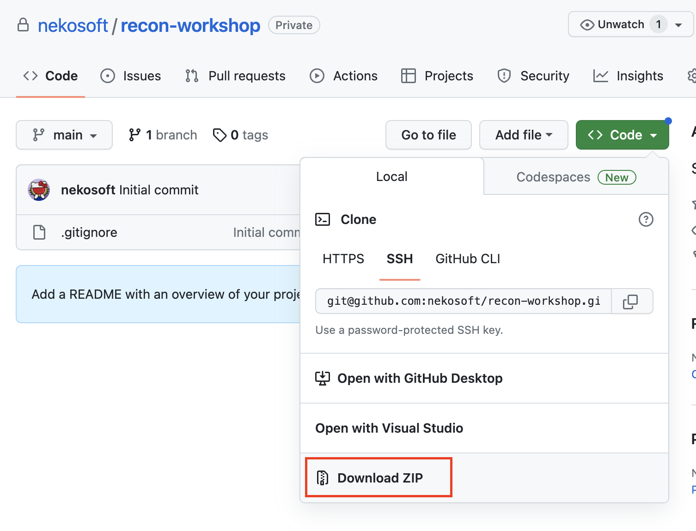

# Scripted Recon Workshop - Setup

This is the initial setup requirements.

## Environment Checklist

- [ ] Python 3
- [ ] Jupyter Lab
- [ ] Dependencies outlined in `requirements.txt`
- [ ] Nice to have: Bash terminal
- [ ] Nice to have: IDE such as VSCode (you can use a terminal within here)


## Project Files

Clone or download the files.

Clone the files from Github:
```
git clone https://github.com/nekosoft/recon-workshop.git
```

Download the files to your machine with the Github UI.



## Environment Setup

Download the latest release for Python 3, for your OS: https://www.python.org/downloads/
We will be using Jupyter Lab, read more here: https://jupyter.org/install
A bash environment is nice but not totally necessary for this course.
It is recommended you use an Integrated Development Environment (IDE) such as VSCode, but it is not specifically required for this course: https://code.visualstudio.com/


### Unix: Setting up the project

Ensure you are in the directory with these project files.

While in the project files directory, it is recommended you use a virtual environment. For example, in your Terminal type:

```
python3 -m venv venv
source venv/bin/activate
```

If you're using VSCode, ensure the Python Interpreter for your virtual environment is selected 

`cmd + shift + p` on Mac, then search for `Python: Select Interpreter` (look for your virtual environment)


Install the dependencies in requirements.txt:

```
pip3 install -r requirements.txt
```


Run Jupyter Lab

```
jupyter-lab
```

Optional OS: Kali Linux OS will have many tools preinstalled: https://www.kali.org/

__Note: If you'd prefer to use your own dependency management, such as Poetry, you are free to do so.__


### Windows: Setting up the project

Download the latest release for Python 3 for Windows: https://www.python.org/downloads/windows/

Getting VSCode and Python working together: https://code.visualstudio.com/docs/python/python-tutorial

If you want bash emulation and to access bash within Jupyter-Lab, install Git bash and launch `jupyter-lab` from the terminal: https://gitforwindows.org/


#### Want a Unix-like environment on Windows?

It may be helpful to use a Unix-like environment, if you feel comfortable. Read more about Windows Subsystem for Linux (WSL) here: https://learn.microsoft.com/en-us/windows/wsl/install

You should be able to set up your environment based on the Unix steps.


#### VSCode

Go to Terminal > New Terminal

While in the project files directory, in your Terminal, start a virtual environment:

```
venv\Scripts\activate
```

Ensure the Python Interpreter for your virtual environment is selected 
- `ctl + shift + p` on Windows, then search for `Python: Select Interpreter`

Install the requirements with pip / pip3:

```
pip install -r requirements.txt
```

or

```
pip3 install -r requirements.txt
```


Run Jupyter Lab

```
jupyter-lab
```

### Using a Virtual Machine or Docker?

I would recommend the Kali Linux distribution: https://www.kali.org/get-kali/#kali-platforms


## Test the project in Jupyter Lab IDE

Inside the project files, launch jupyter-lab from a terminal:

```
jupyter-lab
```

Once `jupyter-lab` server launches, you will have access to a browser based IDE.

Access the file `test.ipynb`. Follow the instructions.
